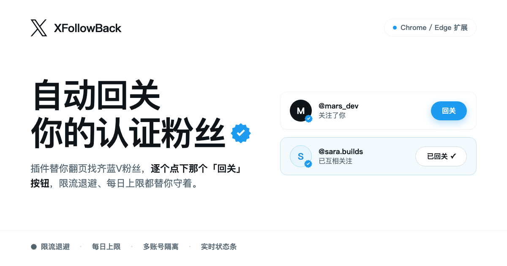

# XFollowBack — X (Twitter) 自动回关认证粉丝
一个 Chrome / Edge 浏览器插件 (Manifest V3),自动回关你的 X (Twitter) **蓝V认证粉丝**,带限流退避、每日上限与实时状态展示。

## ✨ 特性

- **自动回关** — 自动翻页拉取认证粉丝列表(100人/页),逐个关注未回关的用户
- **生产者/消费者架构** — 拉取器与回关循环解耦,通过队列交接,互不阻塞
- **完善的限流处理** — 429 自动退避重试、403+161 今日上限自动暂停至次日、主动等待 rate-limit 重置
- **按账号隔离** — 任务数据与今日计数按账号分键,多账号切换互不干扰
- **状态可视化** — verified_followers 页顶部注入状态条(总数/待回关/今日数),options 控制台提供队列表、设置与日志
- **系统通知** — 自动暂停、达到每日上限等事件通过 Chrome 通知提醒(带声音)
- **零依赖** — 核心逻辑纯 JS,`npm test` 即可运行单元测试(node ≥ 18)

## 🚀 安装与使用

参考:[how2use.md](docs/how2use.md)

## 📦 打包发布

```bash
npm run build
```

自动读取 `extension/manifest.json` 的版本号,将插件打包为 `releases/x-follow-back-v{version}.zip`(排除 `test/`),可直接发给他人加载。

## 🔧 工作原理

```
x.com 标签页
├── page-hook.js  (MAIN world, document_start)
│     hook fetch/XHR 捕获页面自身发出的请求(含全部请求头),
│     再用捕获到的请求头模板重放关键接口:
│       · BlueVerifiedFollowers (GraphQL) — 翻页拉取认证粉丝
│       · /1.1/friendships/create.json (REST) — 回关(仅替换 user_id)
└── content.js    (隔离世界, 唯一入口)
      拉取器(生产者): 翻页拉粉丝 → 纯追加合并进队列,自动翻页/退避/已关注过滤
      回关循环(消费者): 随机间隔 3~8s 逐个关注,失败分类处理与自动恢复
```

数据全部存储在 `chrome.storage.local`,详见 `extension/README.md` 中的存储键说明。

## 🧪 开发与测试

```bash
npm test
```

纯逻辑(响应解析/错误解释/队列合并/停顿判定等)集中在 `extension/src/shared/logic.js`,由 `extension/test/logic.test.js` 覆盖。出过 bug 的场景均有回归测试。

- 改代码后:`npm test` 全绿 → 再到扩展页重载插件
- 需求与决策记录见 `docs/biz-plan.md`

## ⚠️ 免责声明

本项目仅供学习研究使用。自动化操作可能违反 X 的服务条款,请自行评估使用风险,作者不对账号受限等后果负责。
