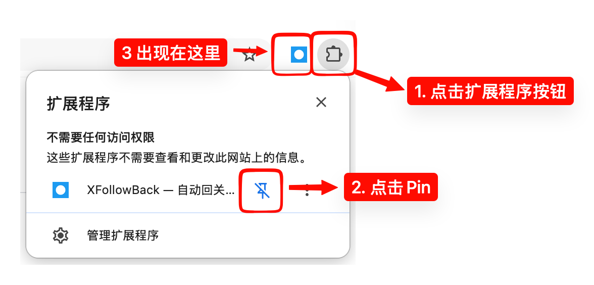
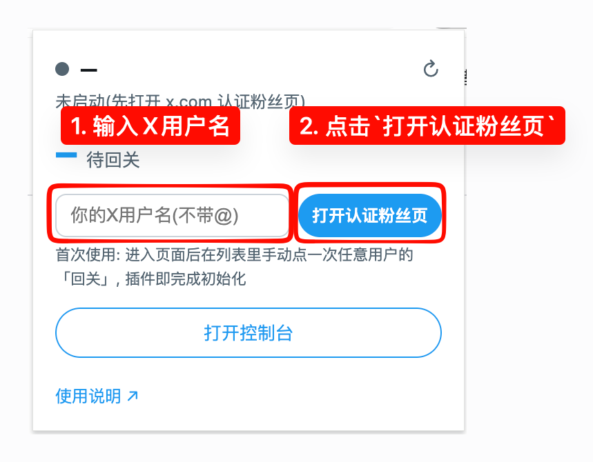
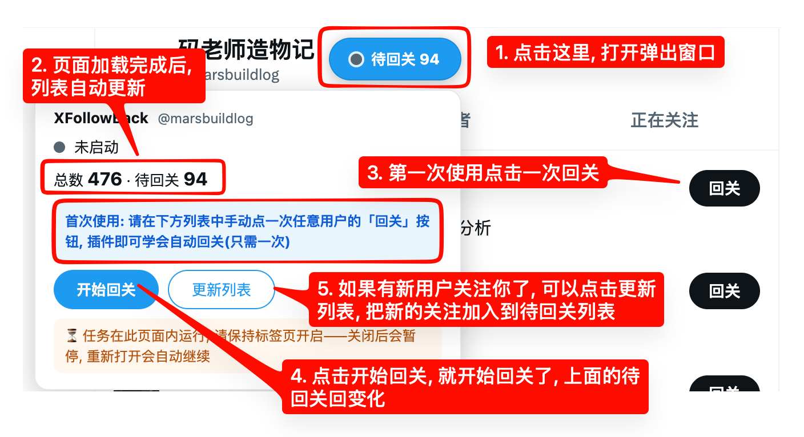

# 如何安装与使用

## 如何安装

> ⚠️ 暂时未申请Chrome Addon Store的权限, 先由安装包的方式来安装, 这种安装属于开发模式

1. 去`https://github.com/marsbuildlog/x-follow-back/releases/x-follow-back-v{x.y.z}.zip` 下载最新版本
2. 解压到本地一个安装文件夹
3. 打开 `chrome://extensions`(Edge: `edge://extensions`)
4. 右上角开启「开发者模式」
5. 点击「加载已解压的扩展程序」, 选择刚才解压缩到的文件夹 
6. [可选]把插件Pin在工具栏, 如下图
   

## 如何使用
1. 保持X账号登录状态, 点开插件Pop弹出窗口, 打开认证粉丝页面, 如下图
   

2. 操作如下图
   

> ⚠️ 任务运行在打开的 x.com 标签页里,**使用期间请保持至少一个x.com认证粉丝页标签开启**;关闭后任务暂停,重新打开会自动接管继续。
